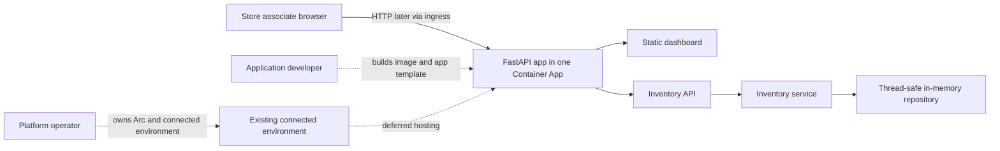

# Contoso Edge Store: Azure Container Apps on Arc templates

This local-first golden path teaches one scenario: operate a small store
inventory API and dashboard, then prepare it for a **later** first deployment
to an existing Azure Container Apps connected environment on Arc-enabled
Kubernetes.

> [!IMPORTANT]
> The current milestone is educational and local-only. Inventory is process
> memory, has no durability, and resets on restart. Do not use it for production
> data. No Docker engine, Azure account, or Kubernetes cluster is needed for
> local tests.

## Command labels

| Label | Meaning |
| --- | --- |
| **Implemented** | Runs locally and is covered by checked-in tests. |
| **Deployment scaffold** | A defensive script, template, or operator procedure that has not been run against Azure or a cluster. |
| **Deferred validation** | Requires the reserved Arc-enabled cluster and explicit operator approval later. |

## Current milestone

**Implemented:** deterministic inventory, health probes, list/get/adjust APIs,
summary metrics, accessible zero-dependency dashboard, in-memory repository,
unit/API tests, and local smoke tests.

**Deployment scaffold:** local/read-only preflight, pinned container definition,
parameterized Container App YAML, ingress smoke tests, diagnostics guidance, and
sample-only dry-run cleanup.

**Deferred validation:** Azure authentication, Arc/extension/custom-location
configuration, image build/push, connected-environment deployment, ingress and
logs on the cluster, and cleanup execution.

## Local quickstart

Run from `aca-arc-templates`.

### PowerShell

```powershell
python -m venv .venv
.\.venv\Scripts\python.exe -m pip install -e ".[test]"
Copy-Item .env.example .env
.\.venv\Scripts\python.exe -m pytest
.\.venv\Scripts\python.exe -m uvicorn app.main:app --host 127.0.0.1 --port 8080
```

In another terminal:

```powershell
.\scripts\smoke-test.ps1
```

### Bash

```bash
python -m venv .venv
./.venv/bin/python -m pip install -e ".[test]"
cp .env.example .env
./.venv/bin/python -m pytest
./.venv/bin/python -m uvicorn app.main:app --host 127.0.0.1 --port 8080
```

In another terminal:

```bash
bash ./scripts/smoke-test.sh
```

Open <http://127.0.0.1:8080/>. Stop Uvicorn with `Ctrl+C`. Docker is not
required for any command above.

## API

| Method | Path | Purpose |
| --- | --- | --- |
| GET | `/health/live` | Process liveness |
| GET | `/health/ready` | Application readiness |
| GET | `/api/inventory` | Sorted inventory |
| GET | `/api/inventory/{sku}` | One item; unknown SKUs return 404 |
| POST | `/api/inventory/{sku}/adjust` | Apply nonzero `quantity_delta`; below-zero stock returns 409 |
| GET | `/api/inventory/summary` | Units, value, and stock status counts |

Example:

```powershell
$body = @{ quantity_delta = 2 } | ConvertTo-Json
Invoke-RestMethod -Method Post -ContentType application/json `
  -Uri http://127.0.0.1:8080/api/inventory/EDGE-TAG-04/adjust -Body $body
```

## Architecture



The platform persona owns cluster prerequisites and the connected environment.
The application persona owns code, image, Container App configuration, ingress
validation, and app-level diagnostics. See [architecture](docs/architecture.md).

## Walkthrough map

1. [Architecture and responsibility boundaries](docs/architecture.md)
2. [Read-only preflight](docs/01-preflight.md)
3. [Container Apps platform setup scaffold](docs/02-enable-container-apps.md)
4. [First application scaffold](docs/03-first-application.md)
5. [Operations and logs](docs/operations.md)
6. [Troubleshooting](docs/troubleshooting.md)
7. [Safe cleanup](docs/cleanup.md)
8. [Later walkthrough roadmap](docs/roadmap.md)

## Safety and cleanup

- `.env` is ignored; examples contain no credentials or real resource IDs.
- `preflight` checks local tools by default. Live read-only queries require
  explicit flags and identifiers and never sign in.
- `cleanup` is dry-run by default, accepts only the exact sample app name
  `contoso-edge-store`, and requires a typed confirmation before deleting that
  Container App.
- Cleanup never deletes a cluster, resource group, registry, or Log Analytics
  workspace. Review [cleanup](docs/cleanup.md) before any later execution.

## Validation status

Local pytest, Python compilation, Bash syntax, PowerShell parser syntax, and
safe static checks are automated in CI. Docker build, YAML submission, Azure
CLI compatibility, connected-environment behavior, ingress, revisions, logs,
and cleanup remain **Deferred validation**. The acceptance criteria are in
[the first-application walkthrough](docs/03-first-application.md).
