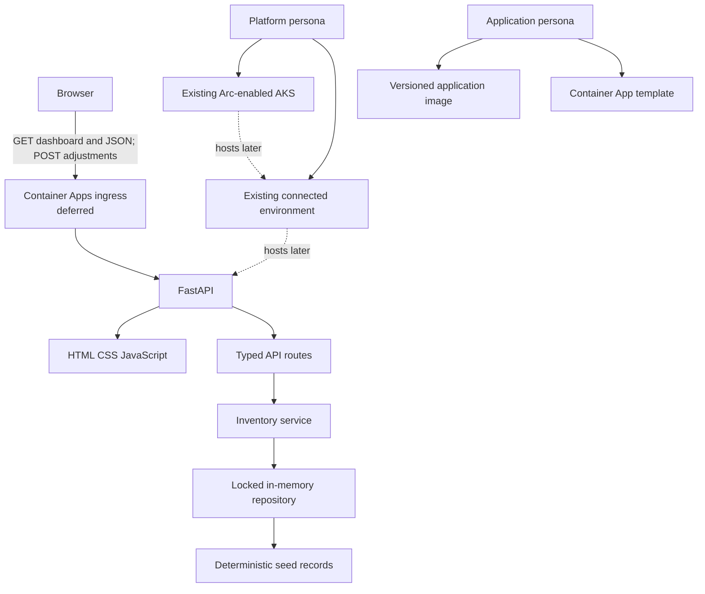

# Architecture

## Milestone boundary

Contoso Edge Store is one Python process serving a static dashboard and a JSON
inventory API. The repository, service, routes, and UI are separate enough to
teach application boundaries without introducing unrelated infrastructure.
Storage is deliberately in-memory and process-local.

## Personas

### Platform persona

- Confirms the reserved cluster is healthy and Arc-connected.
- Confirms supported Container Apps components, custom location, connected
  environment, identity, network, DNS, registry access, and log destination.
- Supplies resource IDs through a private operator configuration, never source.
- Owns any platform rollback.

### Application persona

- Runs local tests and owns API behavior.
- Builds and publishes a unique, immutable image tag.
- Renders and reviews the app template for the supplied environment.
- Validates revision health, ingress, app logs, and sample-only cleanup.

This milestone does not blur the boundary by creating the cluster, Arc
connection, extension, custom location, registry, or workspace.

## Request and data behavior

Pydantic validates adjustment requests before they reach the service. A lock
protects repository reads and adjustments within a process. An adjustment is
atomic: unknown SKUs produce 404, attempts below zero produce 409, and failed
requests do not mutate inventory. Multiple replicas would each have independent
state, which is another reason the scaffold fixes the count at one.

## Security and production gaps

There is no authentication or authorization, durable database, audit history,
TLS policy, rate limiting, secret integration, backup, disaster recovery, or
multi-replica consistency. Treat ingress as a temporary validation endpoint
only. Production hardening is intentionally a later walkthrough.

