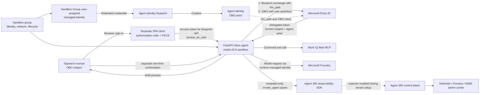

# Inbox agent in an Azure Container Apps sandbox

This development sample follows one customer journey: safely evaluate an inbox
assistant offline, register it as a Microsoft Agent 365 standard agent, and then
run it in a lifecycle-managed Azure Container Apps sandbox. The live path uses
Microsoft Agent Framework, Microsoft Foundry, Microsoft Entra Agent ID,
on-behalf-of (OBO) authentication, governed Work IQ Mail tools, and Agent 365
observability.

> [!IMPORTANT]
> Start offline. Offline mode uses only `sample-data/inbox.json`, does not
> request a Microsoft 365 token, and cannot send mail. Container Apps Sandboxes
> and Work IQ MCP are preview features as of **2026-09-01**. Do not use this
> sample as-is for production or with sensitive mail.
>
> The current Work IQ Mail catalog exposes message search, not a dedicated
> Inbox-folder list operation. Live list and triage can therefore include
> non-Inbox mailbox results; offline fixtures remain Inbox-only. Revalidate
> the generated tool catalog before each live test.

## What you will learn

1. Run deterministic inbox list, read, triage, question, and draft operations.
2. Understand which identity is the human, blueprint, agent, and Azure runtime.
3. Register the standard (non-AI-teammate) agent with Agent 365 Skills.
4. Add privacy-conscious observability and Work IQ Mail under delegated consent.
5. Provision a sandbox group and operate the sandbox from repository scripts.
6. Require a separate, short-lived confirmation before any live send.

## Repository command legend

This guide deliberately avoids guessing preview CLI syntax.

| Label | Meaning |
| --- | --- |
| **Implemented** | Backed by a file in this repository and safe to run with the stated mode. |
| **Official** | A documented command from the linked Microsoft or GitHub product documentation. It can create tenant or cloud resources. |
| **Placeholder** | Describes a future/operator-specific value or action. Never paste angle-bracket values literally. |

For sandbox lifecycle operations, use the checked-in files under
`infra/scripts/`. Those wrappers pin the preview API/SDK contract used by this
sample. This guide does **not** invent `az containerapp sandbox ...` commands.

## Prerequisites

### Offline evaluation

- Windows PowerShell 7 or another shell with equivalent commands.
- Python 3.11 or later (`Dockerfile` uses Python 3.12).
- Git.

### Agent 365 and Azure live path

- A Microsoft Entra work or school account. Personal Microsoft accounts cannot
  manage Container Apps sandboxes.
- A tenant with Agent 365 enabled and a qualifying Agent 365 license assigned
  to at least one user.
- A Microsoft 365 Copilot license for Work IQ MCP.
- Global Administrator, or Agent ID Developer with a Global Administrator
  available to complete OAuth grants.
- An accountable human sponsor for both the blueprint and agent identity.
- An Azure subscription, a region supporting Container Apps Sandboxes and the
  selected Foundry model, sufficient model quota, and permission to deploy the
  resources.
- The **Container Apps SandboxGroup Data Owner** role for the human or runtime
  identity that calls sandbox data-plane operations.
- [GitHub CLI](https://cli.github.com/),
  [GitHub Copilot CLI](https://docs.github.com/en/copilot/how-tos/set-up/install-copilot-cli),
  [Azure CLI](https://learn.microsoft.com/cli/azure/install-azure-cli-windows),
  [Azure Developer CLI](https://learn.microsoft.com/azure/developer/azure-developer-cli/install-azd),
  and a local container engine if you want to build the image locally.

See [preview and licensing caveats](docs/agent365-setup.md#preview-and-licensing-checkpoint)
before asking an administrator for consent.

## 1. Safe offline quickstart

Run these **Implemented** commands from this directory:

```powershell
python -m venv .venv
.\.venv\Scripts\python.exe -m pip install -e ".[test]"
Copy-Item .env.example .env
.\.venv\Scripts\python.exe -m pytest
.\.venv\Scripts\python.exe -m uvicorn app.main:app --host 127.0.0.1 --port 8000
```

In another terminal:

```powershell
Invoke-RestMethod http://127.0.0.1:8000/health
Invoke-RestMethod http://127.0.0.1:8000/api/inbox

$body = @{ question = "Which messages are urgent?" } | ConvertTo-Json
Invoke-RestMethod -Method Post `
  -Uri http://127.0.0.1:8000/api/ask `
  -ContentType application/json `
  -Body $body
```

Open the [sample experience](http://127.0.0.1:8000/) or
[OpenAPI schema](http://127.0.0.1:8000/openapi.json) to inspect triage and
draft creation. Keep `APP_MODE=offline`.

### Why this is safe

- `APP_MODE=offline` selects deterministic fixture-backed tools.
- Offline authentication creates only the fixed local sample identity.
- The default allow-list is `list,read,triage,draft`; `send` is absent.
- Configuration validation rejects `send` in offline mode.
- Even if send is called, the offline mail adapter raises an error.
- Logs contain operation metadata and pseudonymous actor IDs, not tokens,
  prompts, addresses, subjects, or message bodies.

Stop the server with <kbd>Ctrl</kbd>+<kbd>C</kbd>. Delete `.env` before sharing
the workspace if you later add live values.

## 2. Understand the architecture



The blueprint is a template and credential boundary; it is not the running
agent. The agent identity is the actor. The signed-in human remains the subject
of delegated Work IQ calls. The Azure managed identity is a credential used by
the runtime and is federated to the blueprint; it does not become the human or
silently replace the Agent 365 actor. Agent identities and blueprints cannot
perform browser single sign-on. A separate SPA/client registration signs the
human in and requests `api://<blueprint-app-id>/access_as_user`.

Read [Architecture and identity](docs/architecture.md) before configuring live
tokens.

## 3. Register with Agent 365

Install the official skills:

```console
gh skill add microsoft/agent365-skills
```

Restart the coding assistant, open this directory, and request these outcomes
in order:

| Skill | Request to the coding assistant | Result to review |
| --- | --- | --- |
| `a365-setup` | `Set up this project for Agent 365 as a standard OBO agent.` | Prerequisite detection and routing. |
| `make-a365-agent` | `Register this standard agent with Agent 365.` | Blueprint, agent identity, sponsor, permissions, generated configuration. |
| `instrument-observability` | `Complete Agent 365 observability export using OBO authentication.` | Validate the checked-in content-free root, inference, and tool scopes; enable the tenant exporter and check for duplicate framework spans. |
| `add-workiq-tools` | `Add only Work IQ Mail tools to this agent.` | Delegated Mail tooling and its exact requested grants. |

These are skill names and natural-language requests, **not** preview CLI
commands. Review every proposed file and permission. Do not let an automation
overwrite the sample's explicit confirmation gate or add Calendar/Word tools.
See [Agent 365 setup](docs/agent365-setup.md).

### Global Administrator consent checkpoint

If setup runs as Agent ID Developer, it prints a consent URL for a Global
Administrator. Stop and provide the administrator:

- the business purpose and sponsor;
- blueprint and agent identity IDs;
- the exact delegated permissions requested for Work IQ Mail;
- test users and retention plan;
- evidence that `send` remains disabled.

The administrator must inspect the live consent page and grant only the
approved permissions. Declaring a permission on a blueprint does not grant it.
Never copy a consent URL from another tenant or handcraft one.

## 4. Provision and operate the sandbox

Infrastructure deployment is intentionally separate from Agent 365 consent.
Review `infra/`, `.azure/deployment-plan.md`, and the generated `azd` plan
before provisioning.

```powershell
# Implemented discovery command: see exactly which wrappers this revision ships.
Get-ChildItem .\infra\scripts -File | Select-Object Name
```

The Windows wrapper is `infra/scripts/sandbox.ps1`; the POSIX equivalent is
`infra/scripts/sandbox.sh`. Both implement **preflight**, **create**, **port**,
**stop**, **snapshot**, **resume**, and guarded **delete** actions. Mutating
actions require an explicit execute switch, and delete also requires the exact
sandbox ID as confirmation. Read the wrapper first. Never substitute preview
syntax from a blog post. See
[Sandbox lifecycle operations](docs/operations.md#powershell-customer-journey)
for exact wrapper calls, required placeholders, state semantics, and
verification checks.

## 5. Enable live mail last

1. Complete Agent 365 registration, sponsor assignment, admin consent, and
   governance review.
2. Register/configure the separate SPA client for authorization code with PKCE.
   The SPA requests `api://<blueprint-app-id>/access_as_user`; allow-list its
   client ID in the API. A SPA must not contain a client secret.
3. Configure the values listed in `.env.example` from generated outputs or a
   secret store. Use the Sandbox Group user-assigned managed identity as the
   blueprint's federated credential. Do not commit `.env`, tokens, managed
   identity assertions, exchange tokens, generated secrets, or consent URLs.
4. Keep `send` out of `ALLOWED_OPERATIONS` while validating sign-in, OBO, list,
   read, triage, and draft.
5. Confirm telemetry contains no message content or tokens.
6. Add `send` only after the delegated send permission and business control are
   approved.
7. For every send, show the final recipients, subject, and body to the signed-in
   human. Request a new confirmation token, then submit that exact draft and
   token. The token is bound to user, tenant, draft, and action; it expires in
   30–300 seconds and can be consumed once.

The in-memory confirmation and draft stores are suitable for this one-process
sample only. A multi-worker production design needs a shared, atomic,
encrypted store and the same binding/replay guarantees.

## 6. Govern and clean up

Use the Agent 365 registry for inventory and lifecycle ownership; Entra for
identity, permissions, Conditional Access, and access reviews; Defender for
runtime threat investigation; and Purview for data security, DLP, audit, and
eDiscovery. Details are in [Governance and safety](docs/governance.md).

Stopping a sandbox releases CPU and memory but preserves state according to
its suspend mode. It does not revoke tokens, delete snapshots, remove Entra
objects, withdraw consent, or remove the agent from Agent 365. Clean up each
plane explicitly as described in [Operations](docs/operations.md#full-cleanup).

## Troubleshooting

Start with [Troubleshooting](docs/troubleshooting.md). Common first checks are:

- verify `APP_MODE` and the operation allow-list;
- ensure tenant, audience, issuer, user subject, and agent actor are not mixed;
- confirm Global Administrator consent completed in the same tenant;
- confirm the runtime identity has both resource-plane and data-plane roles;
- inspect the repository wrapper output instead of guessing preview CLI flags;
- confirm licensing and a valid root `invoke_agent` span when telemetry is absent.

## Documentation map

- [Architecture and identity](docs/architecture.md)
- [Agent 365 setup](docs/agent365-setup.md)
- [Sandbox lifecycle operations](docs/operations.md)
- [Governance and safety](docs/governance.md)
- [Troubleshooting](docs/troubleshooting.md)
- [Official references and source samples](docs/references.md)

This sample is for learning. Validate current preview contracts, licensing,
regional availability, organizational policy, and generated permissions before
every live deployment.
