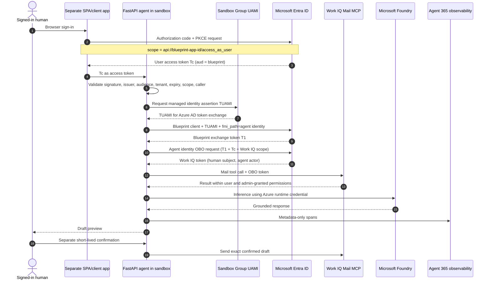

# Architecture and identity

## Trust boundaries

## Identity glossary

| Term | What it is | What it is not |
| --- | --- | --- |
| **Human identity** | The signed-in tenant user whose mailbox and delegated rights constrain the request. A separate SPA/client signs this user in. In OBO, this user is the downstream token **subject**. | Not the agent, blueprint, sponsor, or sandbox managed identity. |
| **SPA/client app** | A separate Entra app registration that can initiate browser authorization code flow with PKCE and request the blueprint's `access_as_user` delegated scope. Its client ID must be allow-listed by the API. | Not the blueprint or agent identity. It must not contain a browser client secret. |
| **Agent identity blueprint** | Entra template and credential boundary for a kind of agent. It declares inheritable permissions and holds credentials used to acquire tokens for child agent identities. | Not an agent instance and not proof that an admin granted a permission. |
| **Agent identity** | The tenant-local Entra service principal for this particular agent. It has its own object ID, sponsor, and assignments. In OBO it is the **actor**. | It does not store credentials itself and is not the human token subject. |
| **Sponsor** | A human business representative accountable for purpose, lifecycle, and access decisions. Assign one to the blueprint and agent identity. | Not merely the deployment operator or a substitute for technical ownership. |
| **Runtime identity** | The Azure managed identity attached to the deployed runtime/sandbox group and used to reach Azure resources such as Foundry or a registry. | Not automatically the Agent 365 agent identity or the OBO user. |
| **Runtime credential** | For this deployment, the Sandbox Group user-assigned managed identity (UAMI). It obtains an assertion that the blueprint accepts through its federated identity credential and is also used for approved Azure resources such as Foundry. | It is not the OBO subject or actor. If the identity capability gate fails, live mode remains blocked; this sample does not implement a certificate or client-secret runtime path. |
| **OBO subject** | The human for whom a delegated operation is performed. | Not a generic “service account.” |
| **OBO actor** | The registered agent identity that performs the operation for the subject. | Not the runtime managed identity merely because that identity starts the process. |

Agent-token claims and logs can represent credential source, actor, and subject
separately. Do not infer actor/subject from a single generic `oid` field. Use the
documented Agent ID token model and let supported libraries perform token
exchange.

## Component responsibilities

| Component | Responsibility |
| --- | --- |
| Separate SPA/client app | Initiate browser SSO as its own app registration, use authorization code with PKCE, request `api://<blueprint-app-id>/access_as_user`, call the API, display drafts, and obtain explicit send confirmation. |
| FastAPI app | Validate inbound token, enforce operation allow-list, bind data to user and tenant, orchestrate tools/model, enforce confirmation. |
| Direct Agent ID token broker | In the primary single-image design, obtain a UAMI assertion, exchange it for blueprint token T1 with the agent identity in `fmi_path`, then exchange T1 plus the validated human assertion for a Work IQ OBO token. Use an approved Agent ID/MSAL library or the sample adapter; never log either assertion/token. |
| Work IQ Mail MCP | Perform governed mailbox operations under delegated permissions. |
| Microsoft Agent Framework | Orchestrate model-backed questions in live mode. Preview construction is isolated behind an adapter. |
| Microsoft Foundry | Host the selected model; authorization comes from the Azure runtime credential. |
| Agent 365 | Register the agent and route supported observability to admin/security/compliance experiences. |
| Sandbox group | ARM boundary for sandboxes, snapshots, images, volumes, secrets, network policy, and lifecycle defaults. |

## Primary direct OBO flow

The single ACA Sandbox image has no companion process. Its token path has two
server-side exchanges after the API validates the SPA's user token:

1. **Federated managed identity exchange.** The process obtains a token/assertion
   from the Sandbox Group UAMI. It authenticates the **blueprint** and supplies
   the child agent identity application ID as `fmi_path`. Entra returns the
   blueprint exchange token, T1, for `api://AzureADTokenExchange/.default`.
2. **OBO exchange.** The process switches the client ID to the **agent identity**
   and submits T1 as its client assertion, the SPA's validated blueprint-audience
   user token Tc as the user assertion, and the approved Work IQ scope. Entra
   returns the delegated Work IQ token: the human is subject and the agent
   identity is actor.

The deployment contract requires the API to reject a token unless its audience
is the blueprint API, its delegated scope includes `access_as_user`, and its
`azp`/`appid` is an approved SPA/client ID. Verify all three gates before live
enablement. A token for Microsoft Graph or Work IQ cannot replace Tc.

Agent identities and blueprints cannot initiate `/authorize` browser SSO.
Their redirect URI support is for consent-only flows, not for obtaining the
user token. Browser sign-in belongs to the separate SPA/client registration.

## Optional sidecar alternative

The Microsoft Entra Agent ID Auth SDK sidecar can perform equivalent supported
protocol work, but it is **not part of this sample's current architecture**. Use
it only with a compatible custom/multi-process image that actually installs,
starts, health-checks, and restricts the sidecar to loopback. Adopting it also
requires deployment, lifecycle, configuration, and threat-model changes. Never
set a localhost sidecar URL in the current single-process image and assume a
sidecar exists.

## Two planes and three lifecycles

Container Apps Sandboxes have an ARM control plane for the sandbox group and an
Azure Developer Compute data plane for sandboxes, files, ports, snapshots, and
related resources. The sample also has independent Agent 365/Entra and
application lifecycles:

1. **Infrastructure:** group, image, sandbox, exposed port, snapshots.
2. **Identity/governance:** blueprint, agent identity, sponsor, consent, policies.
3. **Application:** drafts, confirmations, model calls, tool calls, telemetry.

Deleting something in one lifecycle does not clean up the other two.

## Security invariants

- Offline mode cannot send or perform network-backed mailbox operations.
- Every live request is tenant-bound and audience-validated before OBO.
- Every live user token includes `access_as_user` and comes from an allow-listed
  SPA/client registration.
- The direct broker binds the UAMI-authenticated blueprint exchange to the
  intended child agent identity through `fmi_path`.
- Work IQ uses delegated access; the human's access and tenant policy still apply.
- Tool operations are allow-listed; adding a tool to a manifest is insufficient.
- Send requires a separate, exact-draft confirmation after draft creation.
- Confirmation is action/user/tenant/draft-bound, short-lived, and single-use.
- The checked-in root, inference, and tool scopes omit mail content and
  credentials. Tenant onboarding must still configure and validate the Agent
  365 exporter and check for duplicate framework-generated child spans.
- Preview integration details stay behind adapters and repository scripts so
  contract changes do not spread through the application.

See [Microsoft's identity documentation](references.md#identity-and-authentication)
for the normative model.
