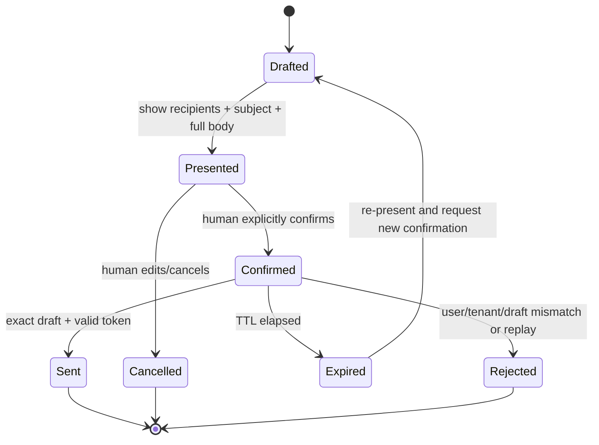

# Governance and safety

The sandbox isolates compute; it does not authorize mailbox access or replace
Microsoft 365 governance. Operate the sample as an agent with an accountable
human, least privilege, observable behavior, and an explicit end date.

## Control map

| Surface | Use it for | Minimum review for this sample |
| --- | --- | --- |
| **Agent 365 / Microsoft 365 admin center** | Registry, inventory, availability, ownership, install/block/retire lifecycle, tool server allow/block controls. | Agent has owner and sponsor; only approved users; Work IQ Mail server allowed; retirement date recorded. |
| **Microsoft Entra** | Blueprint and agent identity, delegated grants, Conditional Access, access packages/reviews, credential federation, sign-in/audit logs. | Separate blueprint/agent/runtime IDs; approved OBO grant; sponsor; least-privilege roles; credential expiry/rotation. |
| **Microsoft Defender** | Runtime visibility, advanced hunting, correlated alerts, unsafe behavior detection and incident response. | Root invocation and tool metadata arrive; alerts route to an owner; response playbook can block agent and stop sandbox. |
| **Microsoft Purview** | Sensitivity labels, DLP, audit, eDiscovery, retention, insider risk and communication compliance where licensed/configured. | Test policy behavior with synthetic labeled content; document lawful purpose, retention, and authorized reviewers. |
| **Azure** | Sandbox RBAC, network/egress, Foundry access, logs, cost and resource lifecycle. | Data-plane role scoped narrowly; public ports minimized; model and sandbox budgets/cleanup alerts. |

Feature availability and licensing differ by plan and region. A documentation
claim is not evidence that a control is enabled in your tenant.

## Sponsor checklist

The sponsor is the accountable business representative, not a placeholder.
Before live enablement, the sponsor approves:

- purpose, users, mailbox data categories, and prohibited uses;
- requested delegated scopes and exact Work IQ tools;
- whether sending is needed at all;
- human confirmation UX and incident escalation;
- retention for telemetry, snapshots, and test artifacts;
- access review cadence and end/renewal date;
- cleanup owner if the sponsor or technical owner leaves.

Entra requires at least one sponsor for the blueprint and each agent identity.
Keep a separate technical owner for operations.

## Explicit send confirmation

Sending is a high-impact operation and is disabled by default. Approval is an
interaction, not a boolean hidden in the original prompt.

Required properties implemented in the sample:

- draft is bound to the authenticated user and tenant;
- confirmation token is HMAC-protected and bound to action, draft, subject,
  tenant, issued time, expiry, and unique ID;
- TTL is 30–300 seconds (120 by default);
- unique ID is consumed atomically in the process and replay is rejected;
- draft becomes terminal when dispatch begins, including an indeterminate
  timeout, to prevent automatic duplicate replies;
- offline send is impossible.

Before enabling live `send`, the UI/client must present the exact recipients,
subject, and body and require an affirmative action that is separate from draft
generation. Editing anything invalidates the confirmation. Never allow a model,
tool, scheduler, or prior chat message to self-confirm.

For scale-out, replace process-local drafts/used-token sets with a shared,
encrypted store that supports conditional writes and expiry. Do not weaken
binding to make multi-worker routing easier.

## Data minimization

- Use synthetic fixtures offline and dedicated test mailboxes live.
- Do not put message bodies, subjects, addresses, prompts, tool payloads,
  access/refresh tokens, confirmation tokens, or consent URLs in telemetry.
- Treat pseudonymous identifiers and correlation IDs as governed data.
- Do not persist mailbox data in snapshots unless the approved purpose requires
  it. Remember a snapshot can include RAM and disk.
- Apply retention/deletion to snapshots and telemetry independently.
- Validate DLP behavior; do not assume “using Purview” means every relevant
  policy is configured or licensed.

## Least privilege and defense in depth

1. Request only delegated Work IQ Mail tools needed for the journey.
2. Start read/draft only; enable send separately.
3. Scope Azure roles to the sandbox group/resource group, not subscription,
   unless an approved design requires broader scope.
4. Require managed-identity federation; block live mode when the identity gate
   fails rather than introducing an unmanaged credential fallback.
5. Use Conditional Access applicable to agent identities and access reviews/
   expiry where licensed.
6. Restrict egress and public ports.
7. Exercise a response: block agent, revoke grant/credential, stop sandbox,
   preserve evidence, notify sponsor, and investigate in Defender/Purview.

## Go-live gate

- [ ] Offline tests pass and no network/mail send occurs.
- [ ] Sponsor and technical/security owners are recorded.
- [ ] License, preview terms, region, quota, and cost are approved.
- [ ] Global Administrator verified exact delegated consent.
- [ ] Agent 365 registry and Entra show the expected distinct objects.
- [ ] The separate SPA uses authorization code with PKCE, has no client secret,
      requests only `api://<blueprint-app-id>/access_as_user`, and its client ID
      is allow-listed by the API.
- [ ] The Sandbox Group UAMI is federated to the blueprint; direct `fmi_path`
      and OBO exchanges succeed without logging Tc, T1, or downstream tokens.
- [ ] Sandbox ingress/egress and RBAC pass review.
- [ ] Observability works without content leakage.
- [ ] Send confirmation is tested for expiry, replay, and cross-user mismatch.
- [ ] Cleanup and incident exercises succeed.

This sample remains a development sample even when every box is checked.
